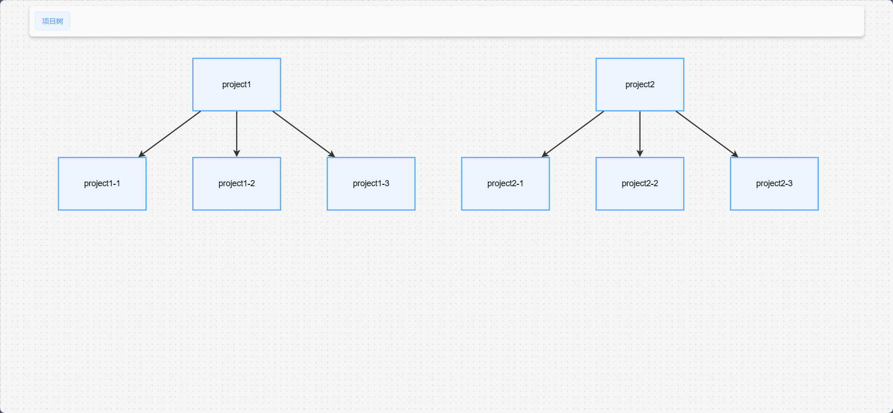

### 1. 安装 tracer
<CodeGroup>
  <CodeGroupItem title="pnpm" active>

```bash:no-line-numbers
pnpm add @tracer/cli @tracer/node @tracer/client -D
```

  </CodeGroupItem>

  <CodeGroupItem title="npm" >

```bash:no-line-numbers
npm i @tracer/cli @tracer/node @tracer/client -D
```

  </CodeGroupItem>

</CodeGroup>

### 2. 配置文件

新建配置文件，写入一下内容

```ts
import { defineConfig } from "@tracer/node"

export default defineConfig({
    base: "/tracer/",
    plugins: [],
})
```
当然你可以指定多个项目，tracer会汇合所有项目及其依赖
```ts
import { defineConfig } from "@tracer/node"

export default defineConfig({
    base: "/tracer/",
    projects: [
      {
        name: "project1",
        path: "project1-root-dir",
        children: [{
          name: "project1-1",
          path: "project1-1-root-dir",
        }]
      }
    ],
    plugins: [],
})
```

### 3. 添加脚本
在package.json添加

```json
{
  "scripts": {
        "tracer:build": "tracer build",
        "tracer:dev": "tracer dev"
    },
}
```

### 4. 启动服务
<CodeGroup>
  <CodeGroupItem title="pnpm" active>

```bash:no-line-numbers
pnpm tracer:dev
```

  </CodeGroupItem>

  <CodeGroupItem title="npm" >

```bash:no-line-numbers
npm run tracer:dev
```

  </CodeGroupItem>

</CodeGroup>

### 你将会看到一个web页面
